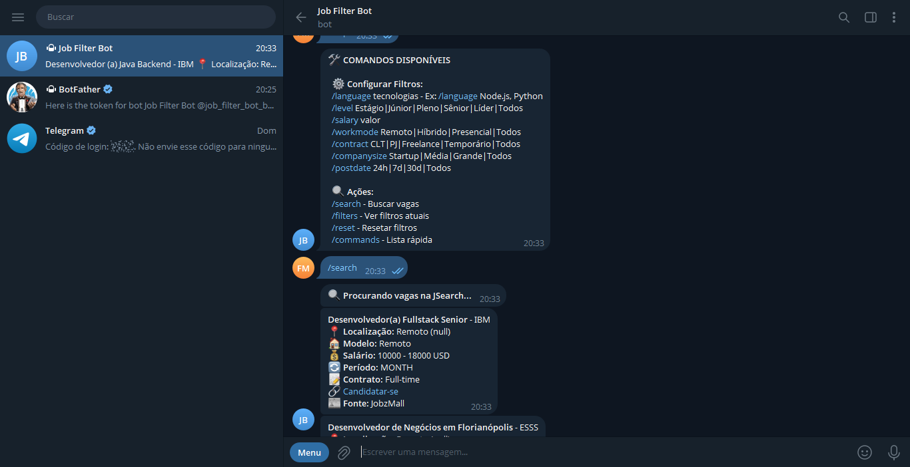

# 🤖 JobFilterBot

Um bot de Telegram para encontrar vagas de tecnologia filtradas por stack, nível, tipo de trabalho e salário — totalmente integrado à **JSearch API** e ao **MongoDB** para salvar as configurações de cada usuário.


---

## Pré-visualização

Confira uma prévia do do projeto:



---

## 📦 Tecnologias Usadas

- [Node.js](https://nodejs.org/) 18+
- [MongoDB](https://www.mongodb.com/) 6.0+
- [Docker](https://www.docker.com/)
- [JSearch API](https://rapidapi.com/letscrape-6xbR2hguA5f/api/jsearch)
- [Telegraf](https://telegraf.js.org/) (Framework para Bots do Telegram)

---

## ✨ Funcionalidades

- 🔎 Busca de vagas filtradas (por stack, nível, salário, remoto/presencial)
- 🎛️ Personalização de filtros
- 🔔 Notificações automáticas em tempo real
- 🌎 Vagas de várias plataformas

---

## 🚀 Começando

### 1. Pré-requisitos

- Node.js >= 18
- Docker e Docker Compose instalados
- Conta gratuita na [RapidAPI](https://rapidapi.com/)
- Bot criado pelo [BotFather](https://t.me/BotFather)

### 2. Instalação manual

```bash
git clone https://github.com/seu-usuario/job-filter-bot.git
cd job-filter-bot
npm install
```

### 3. Configurar variáveis de ambiente

Crie um arquivo `.env` com:

```env
TELEGRAM_TOKEN=seu_token_do_bot
MONGO_URI=mongodb://localhost:27017/jobfilter
RAPIDAPI_KEY=sua_chave_rapidapi
RAPIDAPI_HOST=jsearch.p.rapidapi.com
```

---

## 🐳 Usando com Docker

Subir tudo com 1 comando:

```bash
docker-compose up --build -d
```

Parar os containers:

```bash
docker-compose down
```

> Isso cria o bot e um MongoDB automaticamente em containers separados.

---

## 🎯 Comandos Disponíveis

| Comando         | Descrição                             | Exemplo                   |
|:----------------|:--------------------------------------|:---------------------------|
| `/start`        | Inicia o bot                          | `/start`                  |
| `/level`        | Define o nível de experiência         | `/level Pleno`            |
| `/salary`       | Define o salário mínimo desejado       | `/salary 6000`            |
| `/workmode`     | Define o tipo de trabalho (remoto ou presencial) | `/workmode Remoto` |
| `/search`       | Busca vagas usando os filtros atuais  | `/search`                 |

---

## 🧰 Estrutura do Projeto

```
jobfilterbot/
│
├── configs/       # Configurações de ambiente e conexão
├── controllers/   # Lógica dos comandos do bot
├── models/        # Modelos do MongoDB
├── routes/        # Rotas de integração
├── services/      # Serviços externos (API JSearch, etc.)
├── utils/         # Funções utilitárias
├── Dockerfile
├── docker-compose.yml
├── .env
├── .dockerignore
└── index.js       # Entrada principal
```

---

## 🤝 Como Contribuir

1. Fork este repositório
2. Crie uma branch nova: `git checkout -b feature/nova-funcionalidade`
3. Faça suas alterações e commit: `git commit -m 'feat: adiciona nova funcionalidade'`
4. Envie para o seu fork: `git push origin feature/nova-funcionalidade`
5. Abra um Pull Request 🛠️

---

## 📄 Licença

Distribuído sob a licença **MIT**.  
Veja `LICENSE` para mais informações.

---

## 🔗 Links Úteis

- [Documentação da JSearch API](https://rapidapi.com/letscrape-6xbR2hguA5f/api/jsearch)
- [Guia oficial para Bots do Telegram](https://core.telegram.org/bots)
- [Boas práticas de modelagem no MongoDB](https://www.mongodb.com/docs/manual/core/data-modeling-introduction/)

---
> Feito por mim, [Felipe](https://fm-developer.netlify.app/)
